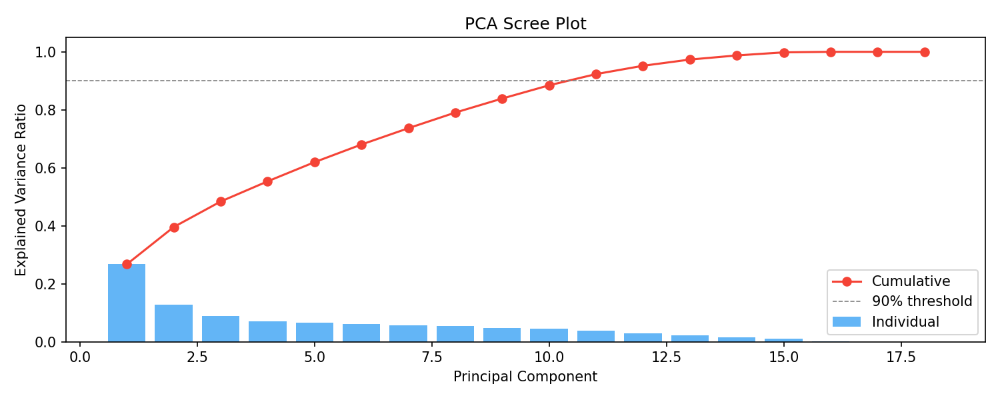
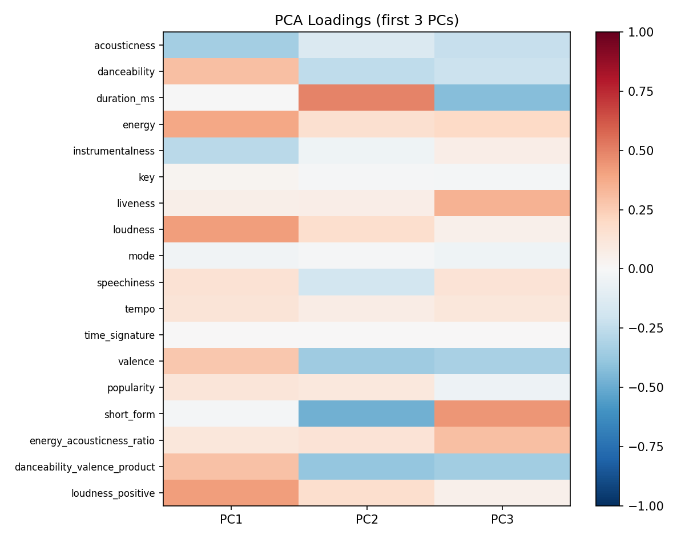
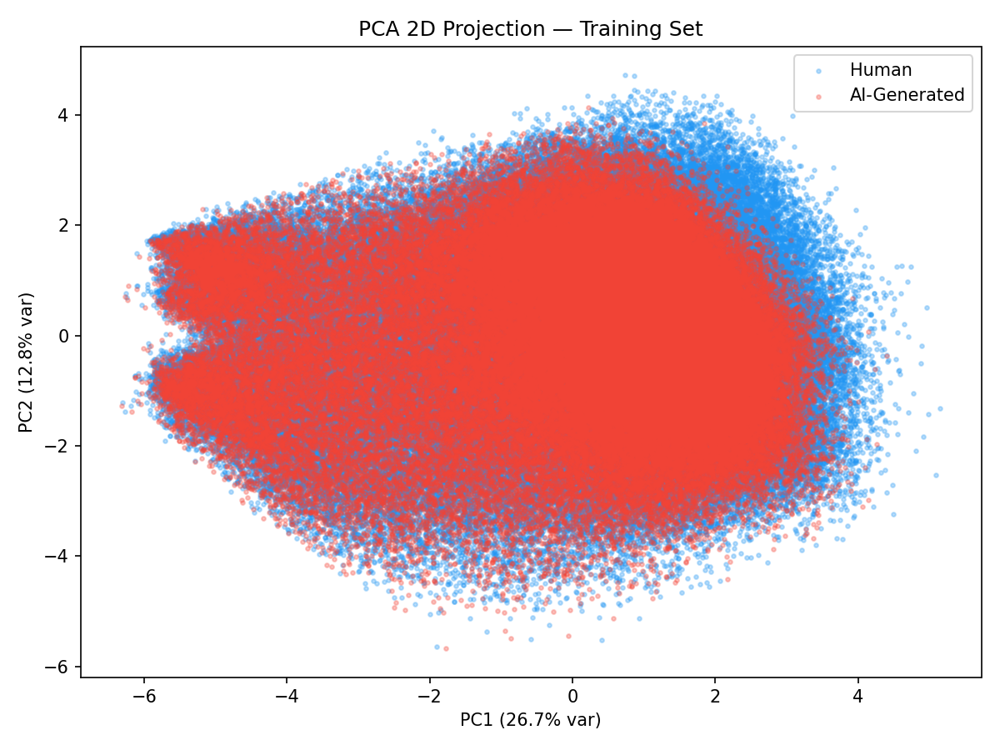
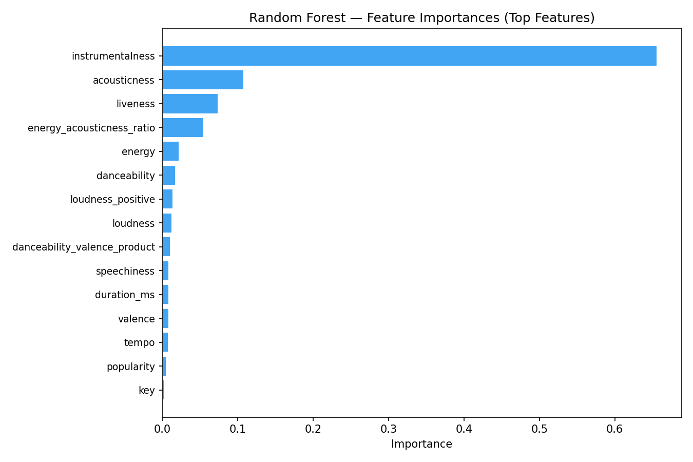
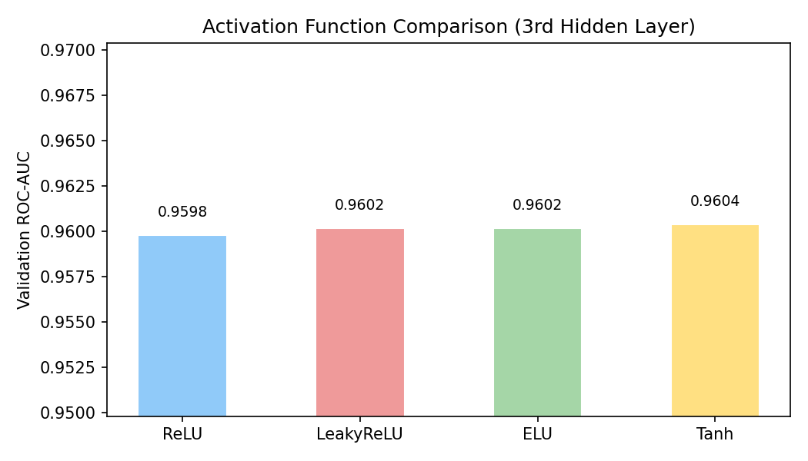
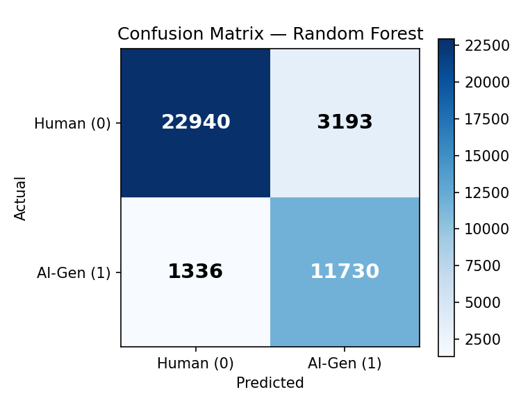
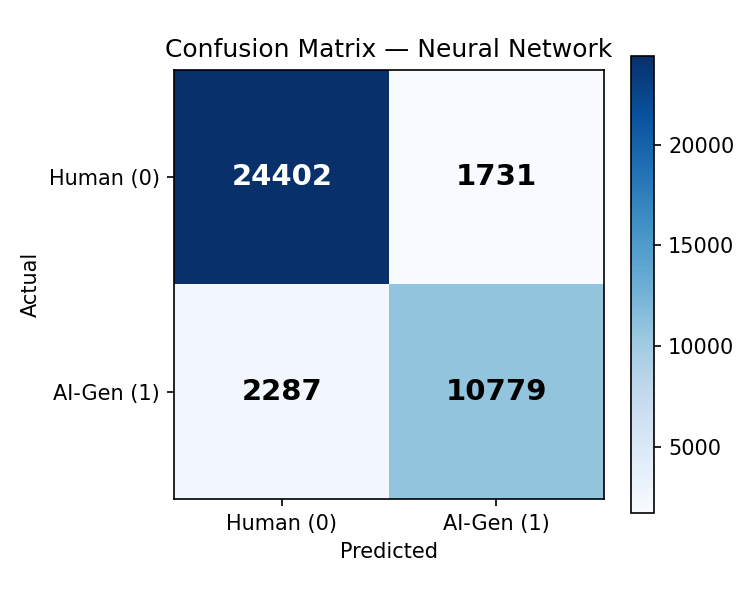
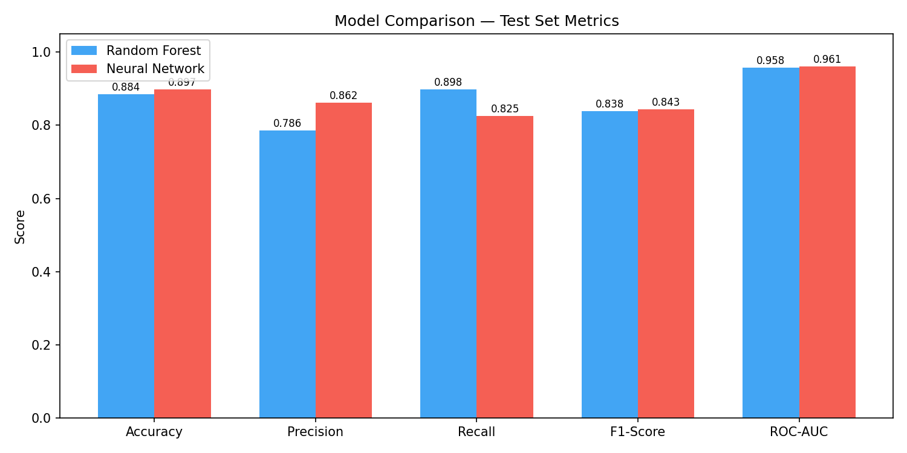
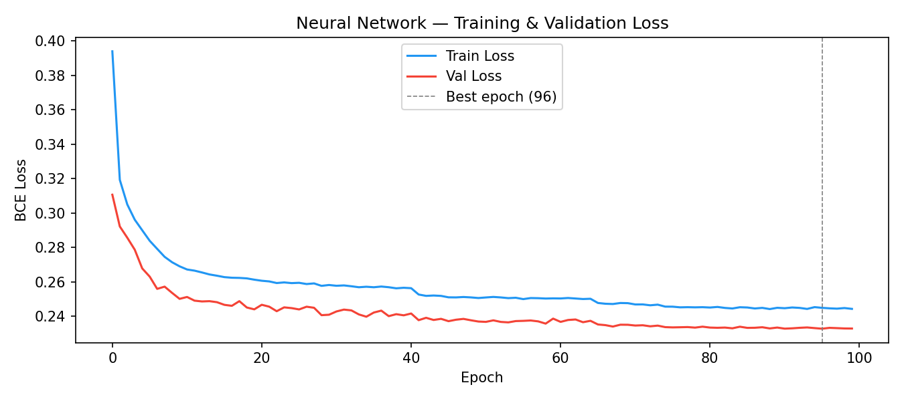
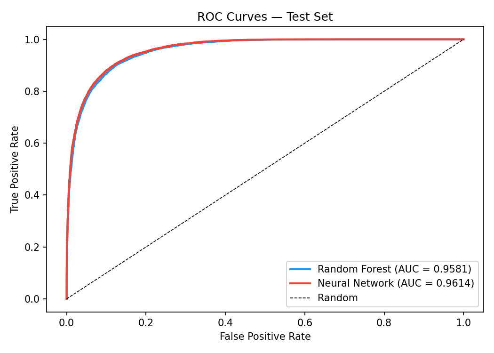

# Homework 1 - From Data to Intelligent Model
___

**Course:** AI Hands-on , NTUA

**Domain:** Social Media Impact on Students

**Name:** Antonia Katsouri

**ID:** 09325010
___
## 1. Problem Description

**Domain:** Music & Streaming — Spotify track metadata.

**Στόχος** Διάκριση μεταξύ μουσικών κομματιών που δημιουργήθηκαν απο καλλιτέχνες και αυτών που δημιουργήθηκαν από τεχνητή νοημοσύνη με βάση ηχητικά χαρακτηριστικά τους όπως για παράδειγμα acousticness, energy, tempo.
Οι πλατφόρμες streaming, οι οργανισμοί διαχείρισης δικαιωμάτων και οι καλλιτέχνες έχουν όλοι συμφέρον από την ανίχνευση προέλευσης ενός μουσικού κομματιού. Ένας αξιόπιστος ταξινομητής επιτρέπει την αυτοματοποιημένη επισήμανση, τη δρομολόγηση δικαιωμάτων και τους ελέγχους ακεραιότητας χωρίς να απαιτείται ανθρώπινος παράγοντας. Το πρόβλημα δεν είναι ασήμαντο, επειδή τα συστήματα τεχνητής νοημοσύνης εκπαιδεύονται όλο και περισσότερο να μιμούνται προφίλ ήχου που έχουν δημιουργηθεί από ανθρώπους.

---
## 2. Dataset Description

**Πηγή:** [Spotify 2026 Synthetic Dataset with Simulation — Kaggle](https://www.kaggle.com/datasets/mdmahfuzsumon/spotify-2026-synthetic-dataset-with-simulation)

**Μέγεθος:** 391989 γραμμές × 20 στήλες (μετά το preproccessing 18 στήλες).

**Target variable distribution:**

Το πλήθος δειγμάτων ανά κατηγορία είναι:
- Κατηγορία '0' - Ανθρώπινος παράγοντας : 261326 δείγματα
- Κατηγορία '1' - Τεχνητή νοημοσύνη : 130663 δείγματα
- Η ήπια ανισορροπία αντιμετωπίστηκε με class_weight='balanced' στο Random Forest και weighted loss στο Νευρωνικό Δίκτυο.

---

## 3. Preprocessing Approach

- Όλα τα στατιστικά στοιχεία προκύπτουν αποκλειστικά από το Training Set (80%) και εφαρμόζονται στα Validation (10%) και Test (10%) sets για την αποφυγή data leakage.
- Split: Έγινε stratified split (80/10/10) με random_state=42.
- Missing Values: Χρήση Median (διάμεσος) από το training set για όλα τα αριθμητικά χαρακτηριστικά.
- Outliers: Εφαρμογή IQR Winsorizing. Τα όρια (Q1 - 1.5IQR / Q3 + 1.5IQR) υπολογίστηκαν μόνο στο training set και οι τιμές στα άλλα sets προσαρμόστηκαν στα όρια αυτά.
- Scaling: Χρήση StandardScaler για μηδενική μέση τιμή και μοναδιαία διασπορά. Το αντικείμενο αποθηκεύτηκε ως models/scaler.pkl
### 3.0 Dropping columns
Οι στήλες "artist_name", "track_id", "track_name", "scenario αφαιρέθηκαν εξαρχής. Αυτό έγινε γιατί:
- Έχουν πάρα πολλές μοναδικές τιμές (υψηλή cardinality), που θα έκαναν το μοντέλο να κάνει overfit σε συγκεκριμένους καλλιτέχνες αντί να μαθαίνει γενικά μουσικά χαρακτηριστικά. 
- Δεν προσφέρουν γενικευμένη πληροφορία για το αν ένα κομμάτι είναι AI ή όχι.

### 3.1 Train / Validation / Test Split (80/10/10)

Η πρώτη λειτουργία που εκτελέστηκε στα ακατέργαστα δεδομένα ήταν ο διαχωρισμός τους. Χρησιμοποιήθηκαν δύο διαδοχικές κλήσεις της train_test_split με την παράμετρο stratify=y για τη διατήρηση της αναλογίας των κλάσεων και random_state=42 για την αναπαραγωγιμότητα των αποτελεσμάτων.

### 3.2 Missing Value Treatment
Χρησιμοποιήθηκε η διάμεσος (median) για τη συμπλήρωση κενών τιμών, καθώς είναι πιο ανθεκτική σε ακραίες τιμές που εμφανίζονται σε μουσικά χαρακτηριστικά. Όλες οι στατιστικές παράμετροι υπολογίστηκαν αποκλειστικά στο Training Set.

### 3.3 Outlier Treatment — IQR Winsorizing

Η συνάρτηση fit_outlier_bounds(X_train) υπολόγισε τα τεταρτημόρια (Q1, Q3) και το εύρος IQR αποκλειστικά για το Training Set. Χρησιμοποιήθηκε η μέθοδος Winsorizing, όπου οι τιμές εκτός των ορίων [Q1 - 1.5IQR, Q3 + 1.5IQR] δεν διαγράφηκαν, αλλά περιορίστηκαν στις τιμές των ορίων. 
Επιλέχθηκετο Winsorizing καθώς το dataset είναι συνθετικό και οι ακραίες τιμές μπορεί να αποτελούν δομικά χαρακτηριστικά των AI τραγουδιών.

### 3.4 Encoding

Μετά την αφαίρεση των στηλών αναγνώρισης (artist_name, track_id, κ.λπ.), και τα εναπομείναντα χαρακτηριστικά ήταν ήδη σε αριθμητική μορφή, οπότε δεν απαιτήθηκε η εφαρμογή One-Hot Encoding. Η συνάρτηση encode() στο αρχείο src/preprocessing.py παραμένει για λόγους πληρότητας.

### 3.5 Feature Scaling

Για την κανονικοποίηση των δεδομένων χρησιμοποιήθηκε ο StandardScaler, ο οποίος προσαρμόστηκε αποκλειστικά στα δεδομένα του X_train και στη συνέχεια εφαρμόστηκε και στα τρία σύνολα (train, validation, test). Η επιλογή του StandardScaler έγινε έναντι του MinMaxScaler καθώς τα χαρακτηριστικά του dataset παρουσιάζουν μεγάλες διαφορές στις κλίμακές τους.

### 3.6 Feature Engineering

1)  **energy_acousticness_ratio** : Υπολογίζεται ως *energy / (acousticness + 1e-6)*. 
- Τα AI κομμάτια τείνουν να έχουν ταυτόχρονα υψηλή ενέργεια και χαμηλή ακουστικότητα. Αυτός ο λόγος ενισχύει αυτό το σήμα, βασιζόμενος στην ισχυρή αρνητική συσχέτιση ($r = -0.71$) που παρατηρήθηκε μεταξύ των δύο μεταβλητών.
2) **danceability_valence_product**: Υπολογίζεται ως το γινόμενο *danceability * valence*. 
- Τα συστήματα παραγωγής μουσικής AI συχνά βελτιστοποιούν ταυτόχρονα τον "χορευτικό" και τον "χαρούμενο/θετικό" χαρακτήρα. Το γινόμενο αυτό αναδεικνύει τους συνδυασμούς υψηλών τιμών που τα μεμονωμένα χαρακτηριστικά δεν μπορούν να συλλάβουν πλήρως.
3) **loudness_positive**: Υπολογίζεται ως *loudness + 60.0*. 
- Δεδομένου ότι η ένταση (loudness) μετριέται σε dB (τιμές $\le 0$), η μετατόπιση σε μια μη-αρνητική κλίμακα βελτιώνει την ερμηνευτικότητα των συντελεστών στην ανάλυση PCA, διατηρώντας παράλληλα τη μονοτονική σχέση με την αντιληπτή ένταση.

---

## 4. PCA Insights

Η Ανάλυση Κύριων Συνιστωσών (PCA) εφαρμόστηκε στα κανονικοποιημένα δεδομένα του X_train (18 χαρακτηριστικά) με την παράμετρο random_state=42. Τα κυριότερα ευρήματα είναι:

### Scree plot 

Scree Plot: Το διάγραμμα δείχνει ότι απαιτούνται 11 κύριες συνιστώσες για να καλυφθεί το 90% της πληροφορίας του dataset. Η σταδιακή πτώση των μπλε μπαρών (individual variance) υποδηλώνει ότι η πληροφορία είναι διαμοιρασμένη σε πολλά χαρακτηριστικά και δεν κυριαρχείται από μία μόνο μεταβλητή.

### PC1 loadings

Το heatmap για τις 3 πρώτες κύριες συνιστώσες παρέχει πληροφορίες για τη δομή των δεδομένων:
- PC1 : Παρατηρούμε ισχυρές θετικές φορτίσεις (πορτοκαλί/κόκκινο χρώμα) στα loudness, loudness_positive, energy και danceability. Αντίθετα, το acousticness και το instrumentalness έχουν αρνητικές φορτίσεις (μπλε). Αυτό σημαίνει ότι η PC1 διαχωρίζει τα δυνατά, ρυθμικά και "ηλεκτρονικά" κομμάτια από τα ήρεμα και ακουστικά. 
- PC2 : Εδώ κυριαρχεί η duration_ms (θετική φόρτιση) σε αντίθεση με τα valence, danceability_valence_product και short_form (αρνητικές φορτίσεις). Η PC2 φαίνεται να διαχωρίζει τα μεγάλα σε διάρκεια κομμάτια από τα σύντομα, χαρούμενα και εμπορικά tracks. 
- PC3 : Η τρίτη συνιστώσα δίνει έμφαση στα short_form, liveness και στο engineered feature energy_acousticness_ratio. Το γεγονός ότι το ratio που κατασκευάσαμε έχει διακριτή παρουσία στην PC3 δείχνει ότι προσφέρει επιπλέον πληροφορία που δεν καλύπτεται πλήρως από τις δύο πρώτες συνιστώσες.

### 2D scatter 

- Μη Γραμμικός Διαχωρισμός: Παρατηρείται εκτεταμένη επικάλυψη μεταξύ των κλάσεων Human (μπλε) και AI-Generated (κόκκινο). Αυτό αποδεικνύει ότι οι δύο κλάσεις δεν μπορούν να διαχωριστούν με μια απλή ευθεία γραμμή (γραμμικός διαχωριστής).
- Πυκνότητα Κλάσεων: Η κλάση AI-Generated φαίνεται να είναι πιο συγκεντρωμένη σε συγκεκριμένες περιοχές του χώρου των συνιστωσών, ενώ τα ανθρώπινα κομμάτια παρουσιάζουν μεγαλύτερη διασπορά.

---
## 5. Model Training

### Random Forest
- Τύπος Προβλήματος: Δυαδική Ταξινόμηση (Human vs AI-Generated).
- Επιλεγμένο Μοντέλο: RandomForestClassifier (200 δέντρα, μέγιστο βάθος 15).
- Διαχείριση Ανισορροπίας: Χρήση class_weight='balanced' για την ορθή αντιμετώπιση της αναλογίας των κλάσεων.
- Απόδοση Validation: Το μοντέλο πέτυχε ROC-AUC: 0.9590, επιβεβαιώνοντας την υψηλή προβλεπτική ικανότητα του pipeline.
- Σημαντικότητα Χαρακτηριστικών (Top-5 Features):
1) instrumentalness
2) acousticness
3) liveness
4) energy_acousticness_ratio 
5) energy



### Neural Network
Πραγματοποιήθηκε σύγκριση τεσσάρων διαφορετικών συναρτήσεων ενεργοποίησης στο Νευρωνικό Δίκτυο (MLP) για την αξιολόγηση της ταχύτητας σύγκλισης και της τελικής ακρίβειας (ROC-AUC):

- Kαλύτερη Απόδοση: Η συνάρτηση Tanh πέτυχε το υψηλότερο σκορ (0.9604), γεγονός που αποδίδεται στην καλύτερη ευθυγράμμιση με τα κανονικοποιημένα δεδομένα (zero-centered inputs) του StandardScaler.
- Ταχύτητα: Η ReLU σύγκλινε ταχύτερα από όλες (μόλις στην 25η εποχή), αλλά υστερούσε ελαφρώς σε ακρίβεια. Οι συναρτήσεις LeakyReLU και ELU παρουσίασαν παρόμοια συμπεριφορά, προσφέροντας μια ισορροπία μεταξύ των δύο.
#### Παρόλο που η Tanh παρουσίασε οριακά καλύτερο ROC-AUC (0.9604), επιλέχθηκε η ReLU για το τελικό pipeline λόγω της ταχύτερης σύγκλισης (25 έναντι 40 εποχών) και του χαμηλότερου υπολογιστικού κόστους, διασφαλίζοντας χαμηλό latency κατά την απόκριση του FastAPI.

- Αρχιτεκτονική:
Input(18) → Dense(128, ReLU) → Dropout(0.3) → Dense(64, ReLU) → Dropout(0.2) → Dense(32, LeakyReLU) → Dense(1, Sigmoid).

- Εκπαίδευση: Χρησιμοποιήθηκε ο optimizer Adam, συνάρτηση απώλειας Binary Cross-Entropy και batch_size=256. Η στρατηγική εκπαίδευσης περιέλαβε Early Stopping και ReduceLROnPlateau για τη βελτιστοποίηση του ρυθμού μάθησης όταν το validation loss παρουσίαζε στασιμότητα.

- Απόδοση Validation: Το μοντέλο πέτυχε κορυφαία επίδοση ROC-AUC: 0.9625, η οποία σημειώθηκε στην 96η εποχή. Η σταδιακή βελτίωση του AUC δείχνει μια υγιή και σταθερή διαδικασία μάθησης.

___

## 6. Model Comparison

### Random Forest Confusion Matrix

Ο Confusion Matrix επιβεβαιώνει ότι το Random Forest λειτουργεί ως ένας 'ευαίσθητος ανιχνευτής'. Προτιμά να κάνει λάθος ταξινομώντας ένα ανθρώπινο κομμάτι ως AI (υψηλά FP), παρά να αφήσει ένα AI κομμάτι να περάσει απαρατήρητο ως ανθρώπινο (χαμηλά FN). Αυτή η συμπεριφορά είναι συνεπής με τη χρήση του class_weight='balanced', που αναγκάζει το μοντέλο να δίνει μεγαλύτερη προσοχή στην κλάση AI.
- Recall (0.898): Ο χαμηλός αριθμός των False Negatives (1.336) σε σχέση με τα True Positives εξηγεί το υψηλό Recall. Το μοντέλο είναι "ευαίσθητο" και καταφέρνει να αναγνωρίσει το ~90% των AI κομματιών. 
- Precision (0.786): Ο σχετικά υψηλός αριθμός των False Positives (3.193) ρίχνει το Precision. 
- Accuracy (0.884): Παρόλο που η ακρίβεια φαίνεται υψηλή, ο Confusion Matrix αποδεικνύει η ακρίβεια είναι παραπλανητική. καθώς αν το μοντέλο προέβλεπε πάντα "Human" (λόγω της ανισορροπίας), θα είχε πάλι υψηλό Accuracy, αλλά ο πίνακας θα είχε μηδενικά στη δεύτερη στήλη.
- F1-Score των 0.838 αποδεικνύει ότι το Random Forest διατηρεί μια πολύ καλή ισορροπία. δηλαδή το μοντέλο ανιχνεύει τα AI-generated κομμάτια χωρίς να κάνει υπερβολικά πολλά λάθη ταξινομώντας ανθρώπινα κομμάτια ως AI. 
- ROC-AUC: 0.958, που σημαίνει ότι αν διαλέξουμε ένα τυχαίο AI κομμάτι και ένα τυχαίο Human κομμάτι, το μοντέλο θα δώσει υψηλότερη πιθανότητα στο AI κομμάτι στο 95.8% των περιπτώσεων.

### Neural Network Confusion Matrix

Ο Confusion Matrix του Neural Network αναδεικνύει ένα μοντέλο με υψηλή εξειδίκευση. Η εντυπωσιακή μείωση των False Positives καθιστά το NN την ιδανική επιλογή.
- Precision (0.862): Εδώ εντοπίζεται η μεγαλύτερη ισχύς του NN. Ο σημαντικά χαμηλότερος αριθμός των False Positives (1.731) σε σχέση με το RF σημαίνει ότι το μοντέλο είναι πολύ πιο αξιόπιστο όταν κάνει μια πρόβλεψη. 
- Recall (0.825): Ο αριθμός των False Negatives (2.287) είναι υψηλότερος από του RF.
- Accuracy (0.897): Η συνολική ακρίβεια είναι η υψηλότερη στο project. Αυτό οφείλεται στο ότι το NN κατάφερε να ταξινομήσει σωστά την πλειονότητα των ανθρώπινων κομματιών (24.402 True Negatives), αποφεύγοντας τα πολλά λάθη που έκανε το RF στην κλάση 0. 
- F1-Score (0.843): Παρά το χαμηλότερο Recall, το F1-Score είναι ελαφρώς υψηλότερο από του RF. Αυτό αποδεικνύει ότι το NN επιτυγχάνει μια καλύτερη μαθηματική ισορροπία μεταξύ Precision και Recall. Είναι το μοντέλο που κάνει τα λιγότερα συνολικά λάθη (FP + FN) αναλογικά με την ανισορροπία του dataset. 
- ROC-AUC (0.961): σημαίνει ότι στο 96.1% των περιπτώσεων, το NN θα δώσει υψηλότερη πιθανότητα σε ένα τυχαίο AI κομμάτι έναντι ενός ανθρώπινου. 

### Side-by-Side Comparison


| Metric | Random Forest | Neural Network |
|---|---------------|----------------|
| Accuracy | 0.8845        | 0.8975         |
| Precision | 0.7860        | 0.8616         |
| Recall | 0.8977        | 0.8250         |
| F1-Score | 0.8382 | 0.8250         |
| **ROC-AUC** | 0.9581        | 0.9614         |

Το **Νευρωνικό Δίκτυο (Neural Network)** αναδεικνύεται ως το βέλτιστο μοντέλο του project, υπερέχοντας στις περισσότερες μετρικές αξιολόγησης. Παρόλο που το Random Forest επέδειξε την υψηλότερη ευαισθησία στον εντοπισμό AI κομματιών (Recall: 0.898), το Νευρωνικό Δίκτυο πέτυχε ανώτερη συνολική ακρίβεια (Accuracy: 0.897) και την κορυφαία ικανότητα διαχωρισμού των κλάσεων (ROC-AUC: 0.961).

Σύμφωνα με την καμπύλη απώλειας (Loss Curve) του Νευρωνικού Δικτύου, η σύγκλιση του Train Loss και του Validation Loss είναι σταθερή, με το Validation Loss να παραμένει συστηματικά ελαφρώς χαμηλότερο, γεγονός που υποδηλώνει ότι οι τεχνικές Regularization απέτρεψαν αποτελεσματικά την υπερπροσαρμογή. Η βελτίωση συνεχίστηκε ομαλά μέχρι την 96η εποχή, αποδεικνύοντας ότι το μοντέλο κατάφερε να εξάγει το μέγιστο δυνατό σήμα από τα δεδομένα.


## 7. Spotify AI-Track Classifier
Αυτή η εφαρμογή είναι ένα FastAPI εργαλείο που χρησιμοποιεί Μηχανική Μάθηση για να προβλέψει αν ένα τραγούδι στο Spotify έχει δημιουργηθεί από AI (Τεχνητή Νοημοσύνη) ή από άνθρωπο, με βάση τα ακουστικά χαρακτηριστικά του.

- **Προαπαιτούμενα**
Βεβαιωθείτε ότι έχετε εγκαταστήσει τις απαραίτητες βιβλιοθήκες:
```python
pip install fastapi uvicorn joblib numpy scikit-learn torch pandas
```
- **Οδηγίες Χρήσης**
1. Εκκίνηση του Server:
Για να τρέξετε το API, ανοίξτε το Terminal και εκτελέστε:
```python
cd hw1/src
python3 -m uvicorn api:app --reload
```
2. Δοκιμή (Interactive Docs)
Μόλις ο server ενεργοποιηθεί, μπορείτε να έχετε πρόσβαση στο διαδραστικό περιβάλλον δοκιμών (Swagger UI) στη διεύθυνση:
 http://127.0.0.1:8000/docs

3. Endpoint Πρόβλεψης
URL: /predict

Input: Δέχεται ένα JSON με 15 χαρακτηριστικά (acousticness, danceability, energy, κτλ).
Output: Επιστρέφει την πρόβλεψη (Human ή AI-Generated) και την πιθανότητα (probability).

Για παράδειγμα:
Παράδειγμα Χρήσης (Input/Output)
Το API δέχεται δεδομένα σε μορφή JSON και επιστρέφει την πρόβλεψη μαζί με την πιθανότητα.
- Input
```
{
  "acousticness": 0.35, 
  "danceability": 0.68, 
  "duration_ms": 210000,
  "energy": 0.72, 
  "instrumentalness": 0.05, 
  "key": 5,
  "liveness": 0.12, 
  "loudness": -8.5, 
  "mode": 1,
  "speechiness": 0.04, 
  "tempo": 122.0, 
  "time_signature": 4,
  "valence": 0.55, 
  "popularity": 40, 
  "short_form": 0
}
```
API Response (Απάντηση συστήματος)
```
{
  "prediction": 0,
  "label": "Human",
  "probability": 0
}
```
Χαρακτηριστικά Μοντέλου - 
Το μοντέλο εκπαιδεύτηκε χρησιμοποιώντας:
- StandardScaler για την κανονικοποίηση των δεδομένων. 
- Feature Engineering (Energy/Acousticness ratio, κτλ). 
- Neural Network 
